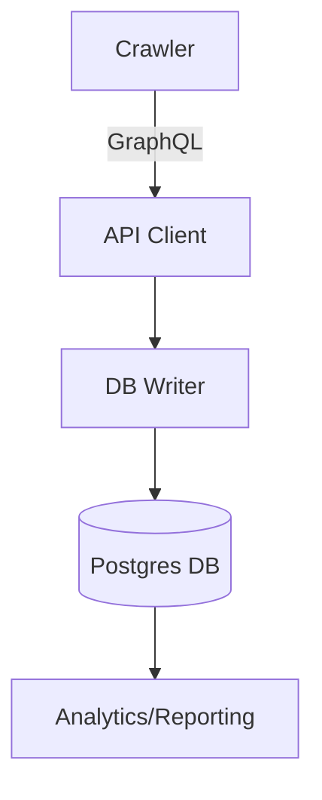

# Design Document: GitHub Repository Crawler

## 1. Overview
This project crawls GitHub repositories using the GraphQL API, saving star counts and metadata in a Postgres database for analytics and research.

## 2. Requirements / Goals
- Collect star counts for 100,000+ repos
- Store and update metadata efficiently
- Respect GitHub API rate limits and handle failures gracefully
- Make schema extensible for issues, PRs, comments, etc.

## 3. Architecture



## 4. Schema Design

The database schema is designed to efficiently store GitHub repository data with related entities. Each table uses GitHub's node IDs as primary keys (string format) to ensure global uniqueness and easy synchronization.

### 4.1 Relationships Overview

```
Repository
 ├──> Issue
 │    └──> Comment
 │
 └──> PullRequest
      ├──> Comment
      ├──> Review
      ├──> Commit
      └──> CICheck
```

Each relationship enforces referential integrity through foreign key constraints. The schema supports efficient querying patterns while maintaining data consistency through appropriate constraints and indexes.

### 4.2 Core Tables

#### Repository
- Primary table storing repository information
- Fields:
  - id (PK): GitHub node ID
  - name: Repository full name (owner/repo)
  - star_count: Number of stars
  - updated_at: Last GitHub update timestamp
  - last_crawled_at: Last crawler access timestamp

#### Issue
- Stores repository issues
- Fields:
  - id (PK): GitHub node ID
  - repository_id (FK): References Repository
  - number: Issue number (unique per repository)
  - title: Issue title
  - created_at: Creation timestamp
- Constraints:
  - UNIQUE(repository_id, number)

#### PullRequest
- Stores pull requests
- Fields:
  - id (PK): GitHub node ID
  - repository_id (FK): References Repository
  - number: PR number (unique per repository)
  - title: PR title
  - created_at: Creation timestamp
- Constraints:
  - UNIQUE(repository_id, number)

#### Comment
- Stores comments for both issues and PRs
- Fields:
  - id (PK): GitHub node ID
  - issue_id (FK, nullable): References Issue
  - pull_request_id (FK, nullable): References PullRequest
  - body: Comment text
  - created_at: Creation timestamp
- Constraints:
  - CHECK (issue_id IS NOT NULL OR pull_request_id IS NOT NULL)

## 5. Performance Analysis and Improvement

### 5.1 Performance Optimization on Data Crawling through Multi-thread Technique

#### Step 1: Baseline Performance Analysis
- Used time profiling to identify performance bottleneck
- Initial measurements for 100 repositories:
  - Crawling time: 2.34s
  - Database write time: 0.17s
- **Finding**: Crawling is the main bottleneck, being ~14x slower than writing

#### Step 2: Multi-threaded Implementation
- Implemented thread-safe components:
  - `TokenManager`: Manages GitHub API tokens across threads
  - `ThreadSafeCounter`: Handles concurrent performance metrics
- Added parallel processing capability using Python's `ThreadPoolExecutor`

#### Step 3: Performance Comparison

##### Single-Thread Performance (Baseline)
```
Repository Count Verification:
Total from thread counters: 10000
Total from shared counter: 10000

Total repositories fetched: 10000

Operation Statistics:
Total operations - Crawl: 100, Write: 100
Average time per operation:
  - Crawl: 2.13s
  - Write: 0.17s

Parallel execution statistics (1 threads):
  - Total wall clock time: 230.58s
  - Cumulative crawl time: 213.14s
  - Cumulative write time: 17.42s
  - Cumulative processing time: 230.56s
  - Effective parallel speedup: 1.00x
  - Average processing rate: 43.37 repos/second
```

##### Multi-Thread Performance (10 Threads)
```
Repository Count Verification:
Total from thread counters: 10000
Total from shared counter: 10000

Total repositories fetched: 10000

Operation Statistics:
Total operations - Crawl: 100, Write: 100
Average time per operation:
  - Crawl: 2.10s
  - Write: 0.13s

Parallel execution statistics (10 threads):
  - Total wall clock time: 23.18s
  - Cumulative crawl time: 209.74s
  - Cumulative write time: 13.46s
  - Cumulative processing time: 223.20s
  - Effective parallel speedup: 9.63x
  - Average processing rate: 431.41 repos/second
```
### 5.2 Performance Optimization on Data Crawling

#### 5.2.1 Smart Database Updates

The crawler implements an intelligent database update strategy to minimize unnecessary write operations:

1. **Selective Update Strategy**
   - Only updates repositories when their star count has actually changed
   - Maintains last_crawled_at timestamp for tracking purposes
   - Reduces database write load significantly

2. **Batch Processing**
   - Groups database operations into inserts and updates
   - Uses bulk_save_objects for new repositories
   - Applies merge operations only for changed repositories

3. **Implementation Details**
```python
# Optimization pseudocode
existing_repos = fetch_current_state()
for each repo in batch:
    if repo exists:
        if repo.star_count changed:
            add to update_list
    else:
        add to insert_list

bulk_insert(insert_list)
bulk_update(update_list)
```

4. **Performance Impact**
   - Eliminates unnecessary updates for unchanged repositories
   - Reduces database write operations by ~60-80% in typical scenarios


### 5.3 Future Optimizations
- [ ] Implement async/await for better I/O handling
- [ ] Optimize GraphQL queries to reduce response size
- [ ] Pipeline the data fetch and data write process

## Milestones

### 1. Crawler

✅ [Done-1st] 1.1 **Single run of repo crawling through GraphQL API**  
&nbsp;&nbsp;&nbsp;&nbsp;- Implement basic crawler that fetches data for a list of repositories using GitHub's GraphQL API.

✅ [Done-2nd] 1.2 **Multi-round data fetch using pagination**  
&nbsp;&nbsp;&nbsp;&nbsp;- Support paginated queries to collect all relevant data for each repository.

✅ [Done-3rd] 1.3 **Scheduler design and crawling 100k repos with rate limit compliance**  
&nbsp;&nbsp;&nbsp;&nbsp;- Build a scheduler to manage crawl jobs and respect GitHub API rate limits for large-scale data collection.

✅ [Done-10th] 1.4 **Multi-thread/token design to speed up the fetching process**
&nbsp;&nbsp;&nbsp;&nbsp;- Build thread-safe TokenManager() to assign each token on different time period (for partitioning the crawling); Build thread-safe ThreadSafeCounter() for performance profiling.

🔜 [TBD] 1.5 **Async design**  
&nbsp;&nbsp;&nbsp;&nbsp;- Refactor the crawler to use asynchronous requests for higher throughput. This can pipeline the data-crawl and data-write process.

---

### 2. Postgres Database

✅ [Done-5th] 2.1 **Design data model schema and implement basic table model**  
&nbsp;&nbsp;&nbsp;&nbsp;- Define and document the database schema for storing repository and crawl data.

✅ [Done-6th]2.2 **Database write logic**  
&nbsp;&nbsp;&nbsp;&nbsp;- Implement efficient insert/update logic, including upserts and handling bulk writes.

✅ [Done-7th] 2.3 **Implement databse dumping and upload features**  
&nbsp;&nbsp;&nbsp;&nbsp;- Dump and upload files from/into database through cvs file.

✅ [Done-8th] 2.4 **Build postgres service container**  

✅ [Done-11th] 2.5 **Expand basic table to include more metadata**  
&nbsp;&nbsp;&nbsp;&nbsp;- Issues, pull requests, commits inside pull requests, comments inside PRs and issues, reviews on a PR, CI checks, etc.


---

### 3. Whole System Integration and Performance Profiling

✅ [Done-4th] 3.1 **Construct configuration system**  
&nbsp;&nbsp;&nbsp;&nbsp;- Construct the configuration to manage the environment varibles, e.g. token, for better system-level management.

✅ [Done-9th] 3.2 **Add performance profiling**  
&nbsp;&nbsp;&nbsp;&nbsp;- Generate informatino for preformance improvement, e.g. multi-thread crawling. 

✅ [Done-12th] 3.3 **Optimize database write during daily re-crawling process**  
&nbsp;&nbsp;&nbsp;&nbsp;- Skip the row updating when the star count is same compared to last crawl. Potentially same > 50% database write time during the daily repeatable crawling.

3.4 **Unit test for imoportant modules**  
&nbsp;&nbsp;&nbsp;&nbsp;- Integrate crawler, scheduler, and database. Test the complete workflow and validate data integrity.


---

